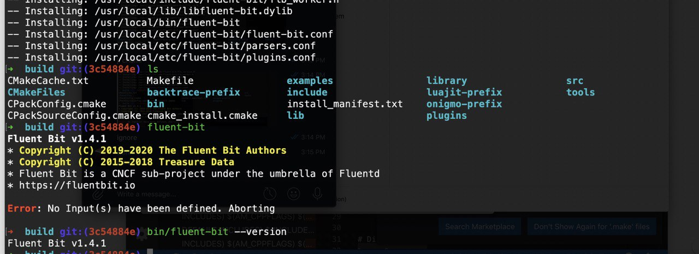

Using Fluent-bit v1.4.1 compiled locally on MacOS on the top of commit id [3c54884e](https://github.com/fluent/fluent-bit/commit/3c54884e)

<p align="center">
  
</p>

### Basic configuration file that generates random data using one of our input plugins and sends it to stdout.

[Fluent-bit.conf](https://github.com/championshuttler/fluentbit-basic/blob/master/fluent-bit.conf)

### Command-line that retrieves Fluent Bit Version by using it HTTP interface

We can use `curl` command to gather information about `fluent-bit`.

First we need to run fluent-bit with our basic configuration file: 

```bash
build/bin/fluent-bit -c fluent-bit.conf

Fluent Bit v1.4.1
* Copyright (C) 2019-2020 The Fluent Bit Authors
* Copyright (C) 2015-2018 Treasure Data
* Fluent Bit is a CNCF sub-project under the umbrella of Fluentd
* https://fluentbit.io

[2020/05/21 08:49:05] [ info] [storage] version=1.0.3, initializing...
[2020/05/21 08:49:05] [ info] [storage] in-memory
[2020/05/21 08:49:05] [ info] [storage] normal synchronization mode, checksum disabled, max_chunks_up=128
[2020/05/21 08:49:05] [ info] [engine] started (pid=13923)
[2020/05/21 08:49:24] [ info] [http_server] listen iface=0.0.0.0 tcp_port=2020
2020/05/21 08:49:30] [debug] [engine] coroutine stack size: 12288 bytes (12.0K)
2020/03/10 08:49:24] [debug] [input:random:random.0] interval_sec=1 interval_nsec=0
...
```

Then we can use `curl` command:

```bash
curl -s http://127.0.0.1:8888 | jq
{
  "fluent-bit": {
    "version": "1.4.1",
    "edition": "Community",
    "flags": [
      "FLB_HAVE_PARSER",
      "FLB_HAVE_RECORD_ACCESSOR",
      "FLB_HAVE_STREAM_PROCESSOR",
      "FLB_HAVE_TLS",
      "FLB_HAVE_SIGNV4",
      "FLB_HAVE_SQLDB",
      "FLB_HAVE_METRICS",
      "FLB_HAVE_HTTP_SERVER",
      "FLB_HAVE_FORK",
      "FLB_HAVE_TIMESPEC_GET",
      "FLB_HAVE_GMTOFF",
      "FLB_HAVE_UNIX_SOCKET",
      "FLB_HAVE_PROXY_GO",
      "FLB_HAVE_SYSTEM_STRPTIME",
      "FLB_HAVE_LIBBACKTRACE",
      "FLB_HAVE_REGEX",
      "FLB_HAVE_UTF8_ENCODER",
      "FLB_HAVE_LUAJIT",
      "FLB_HAVE_C_TLS",
      "FLB_HAVE_ACCEPT4",
      "FLB_HAVE_INOTIFY"
    ]
  }
}

```

<p align="center">
  
</p>


